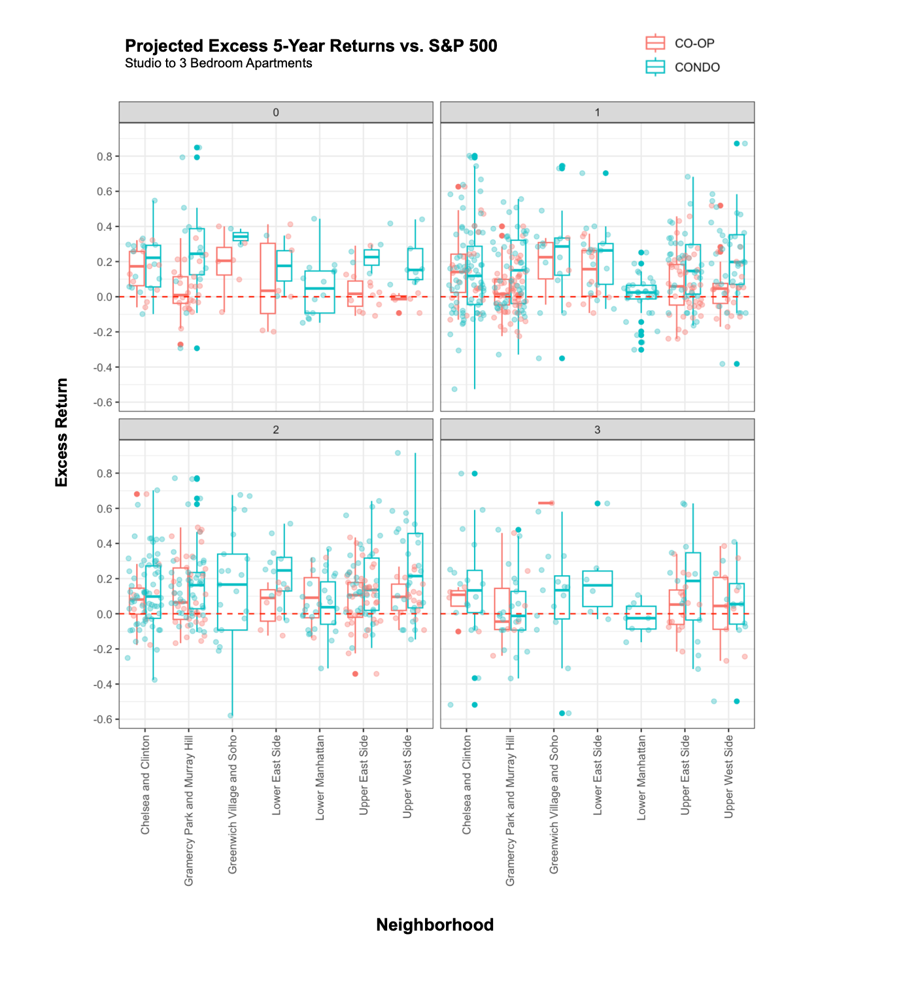

# manhattan_property_analysis
Analysis of real estate data in Manhattan (2024).

## Summary
As someone who lives in Manhattan, I was wondering what might might make sense as a next move for myself. There are a lot of opinions about renting vs. buying but given how weird property in NYC can be, I decided to get hands on with the data and try to figure out a few things for myself:

- Broadly, what does the Manhattan rental market and sale market look like? 
- How do co-ops compare with condos?
   - (A ***co-op*** is a type of apartment in NYC distinct from a typical condominum (short for "cooperative"). In co-ops, you (and the other residents) own a shares in a company that owns the building instead of directly owning the deed to the apartments. These can have restrictions such as not able to rent to non-owners)
- How does renting compare with buying from a long-term financial perspective?
- How much do apartments in Manhattan appreciate by? How does it stack up against investing in an index fund? 
- What type of apartments are the most attractive for investing? What are the income requirements / capital requirements for those?

To answer the questions I wrote the ```zillow_scraper``` package to download and process data from Zillow.com, then analyzed the data. 


## Findings

- Looked at 6.2k rental listings and 6.9k sale listings collected in March 2024, narrowed down sale listings to 1.5k listings with historical sale data to get information on historical annualized returns
- Co-ops have higher HOA fees than condos (so less of your monthly cost will go to building equity), but are more affordable overall (the cost per sqft of condos is ~50% higher on average)
   - Although you might expect higher HOA fees might be associated with lower returns (since you'd ideally want to purchase property with less maintenance cost all else being equal), there was no significant association between returns and HOA fees in the data collected. 
- Interestingly, the monthly cost of renting is not significantly higher than buying a co-op w/ a mortgage (in fact it is actually higher in some neighborhood - bedroom combinations), the monthly cost of a condo w/ a mortgage is typically significantly more expensive than renting
   - However, rentals do have more space per monthly cost than co-ops
- Historical annualized returns (CAGR) for owning Manhattan apartments (co-op and condos) is lower than S&P 500 and can have high volatility depending on # beds and neighborhood (however: if you take out a mortgage, your ROI on the mortgage is generally higher than S&P 500, but subject to higher volatility)
- The group of properties that seem to have the best ratio of returns to volatility are 1 bedroom condos on the Upper East Side (median of 5% annualized return, with 4% SD, n = 39 observations) if you take a 80% mortgage out, your returns on your downpayment is essentially multiplied by 5x - so you'd have 25% annualized return with 20% SD vs 9.27% annualized return and 18.57% SD from S&P 500 from 1871 to 2023 (this is purely looking at ROI on downpayment, excluding equity, rent, monthly payments, etc.)
   - For the cheapest listing in this class, you'd need at least a $137k annual income and $99k for a downpayment (not including fees and taxes) - in comparison to afford a median listing (so you can afford the bottom 50% of listings), you'd need at least a $218k annual income and $191k for a downpayment




## Contents
- ```data/ ``` - contains all data that was collected and annotated for this analysis. 
- ```download_and_process_data.ipynb``` - code that was used to download, annotate (HOA fees, building type, historic sales data, etc.) and pre-process data (calculate average historical returns)
- ```analysis.Rmd``` - code for analysis of data and generating plots
